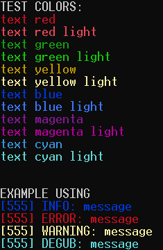
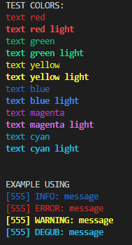

# C launguage Terminal / Console Colors

> Simple library for creating more colorful console logs. 

## Screenshots
Colors depend on terminal. [Here you can find out more about it!](https://en.wikipedia.org/wiki/ANSI_escape_code#Colors)
### Ubuntu WSL console

### vscode console

#

## How to use
### Build
* copy color folder(directory) to your project,
* add color.c to compile target,
* include color folder (directory),
* you can find out build system example in CMakeLists.txt
### Member functions
> `char * c_color(const char *const color_name, const char *message)`
* param `color_name` (defined or [specific](https://en.wikipedia.org/wiki/ANSI_escape_code#Colors)) example: `c_red` or `"[0;31m"`
* param `message` example: `"I want this red!"`
* return value `char * message`, example: `\033[0;31mI want this red!\033[0m`
* Defined color you can find out in header file `color.h`
